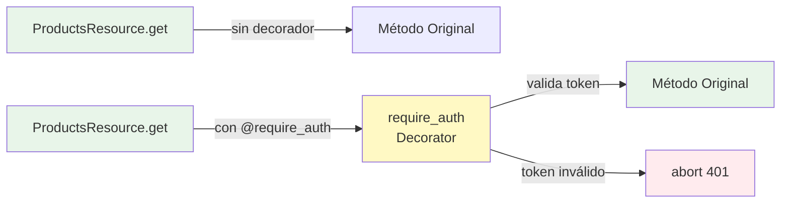
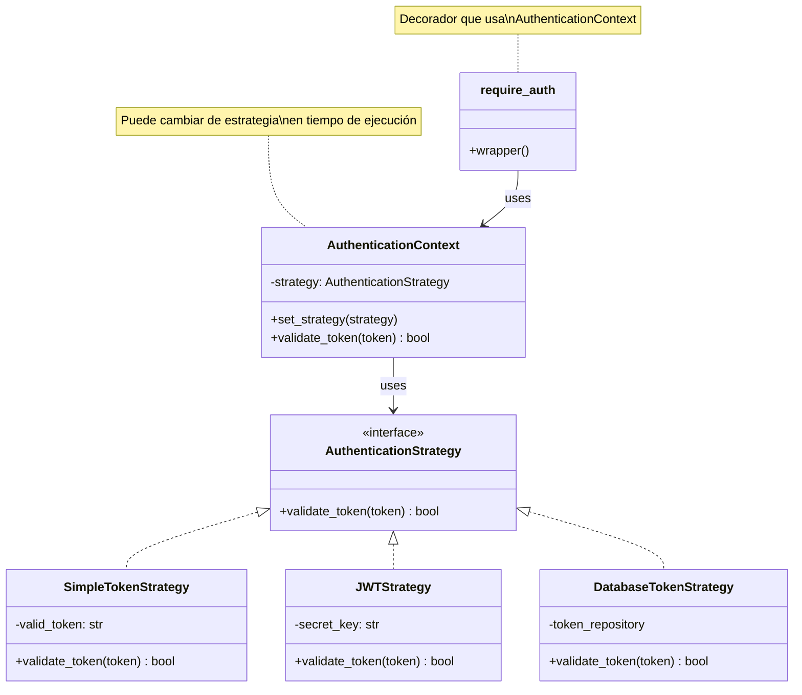
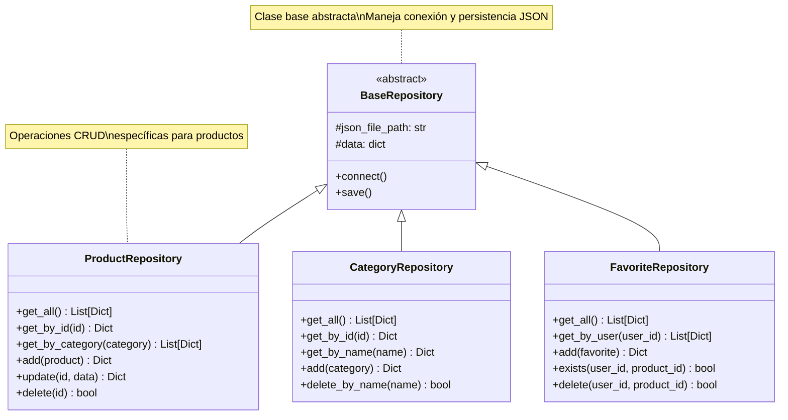
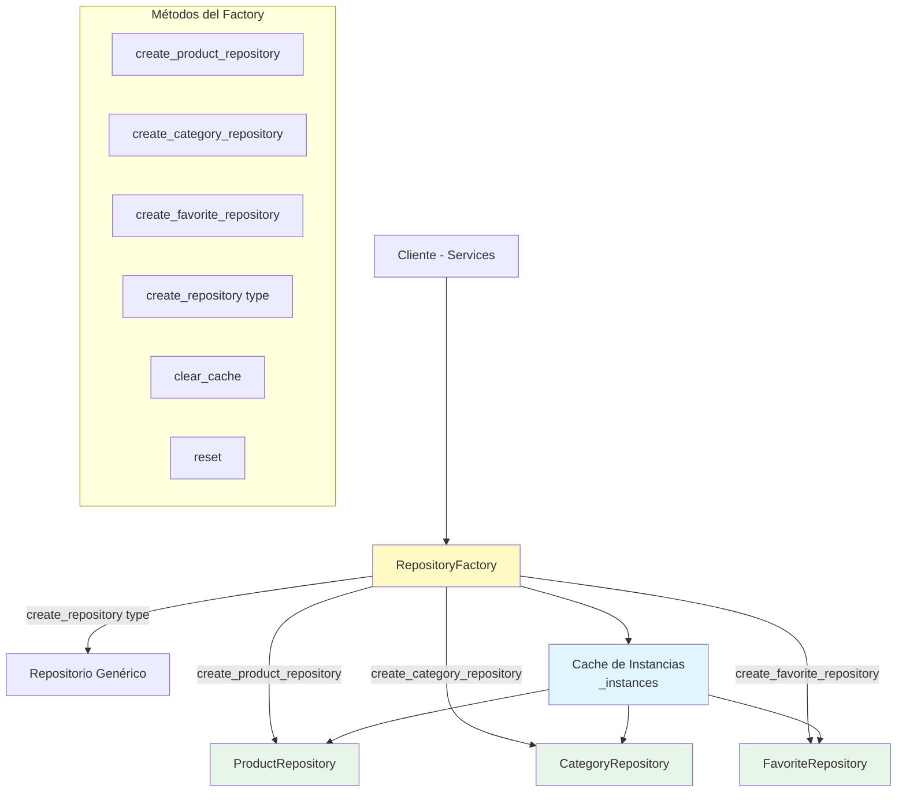
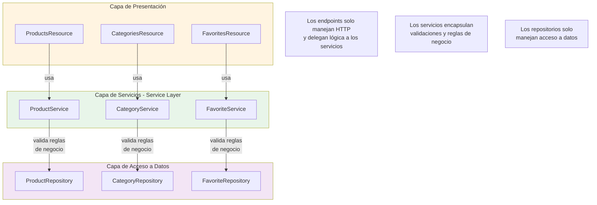
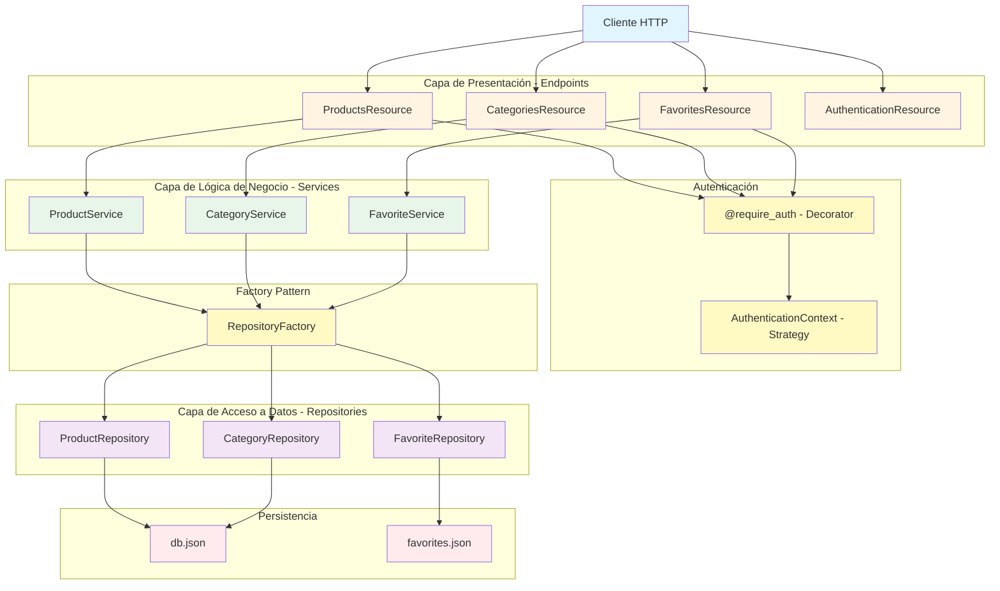

# Análisis y Refactorización del Proyecto

## Identificación de Problemas y Code Smells

### 3.1 Código Duplicado (DRY Violation)
- **Problema**: La función `is_valid_token()` está duplicada en `products.py`, `categories.py` y `favorites.py`
- **Impacto**: Dificulta el mantenimiento y puede llevar a inconsistencias

### 3.2 Inconsistencia en Tokens
- **Problema**: En `auth.py` se genera el token `'abcd12345'` pero en los otros archivos se valida `'abcd1234'`
- **Impacto**: La autenticación no funciona correctamente

### 3.3 Validación de Token Repetida
- **Problema**: El código de validación de token se repite en cada método de cada recurso
- **Impacto**: Violación del principio DRY y dificulta cambios futuros

### 3.4 Violación del Principio de Responsabilidad Única (SRP)
- **Problema**: `DatabaseConnection` maneja múltiples responsabilidades (productos, categorías, favoritos)
- **Impacto**: Dificulta el mantenimiento y la extensibilidad

### 3.5 Acoplamiento Fuerte
- **Problema**: Los recursos están fuertemente acoplados a `DatabaseConnection`
- **Impacto**: Dificulta el cambio de implementación de persistencia

### 3.6 Falta de Separación de Responsabilidades
- **Problema**: Lógica de negocio mezclada con lógica de API en los recursos
- **Impacto**: Dificulta el testing y la reutilización

### 3.7 Manejo de Errores Inadecuado
- **Problema**: Uso de `print()` en lugar de excepciones o logging apropiado
- **Impacto**: Dificulta el debugging y el manejo de errores

### 3.8 Bugs en categories.py
- **Problema 1**: Línea 50 compara `new_category_name` (string) con `categories` (lista)
- **Problema 2**: Línea 85 compara `cat["name"] != category_to_remove` cuando debería ser `cat["name"] != category_to_remove["name"]`
- **Impacto**: Funcionalidad incorrecta

### 3.9 Falta de Abstracción
- **Problema**: No hay interfaces o abstracciones para la persistencia
- **Impacto**: Dificulta el cambio de implementación (ej: de JSON a base de datos)

### 3.10 Método Faltante
- **Problema**: En `favorites.py` se llama a `self.db.save_favorites()` pero no existe en `DatabaseConnection`
- **Impacto**: Error en tiempo de ejecución

---

## Propuesta de Soluciones

### 4.1 Patrón Decorator para Validación de Tokens
- **Objetivo**: Centralizar la validación de tokens y evitar código duplicado
- **Implementación**: Crear un decorador que valide el token antes de ejecutar los métodos

### 4.2 Patrón Strategy para Autenticación
- **Objetivo**: Permitir diferentes métodos de autenticación
- **Implementación**: Crear una interfaz de autenticación con diferentes estrategias

### 4.3 Patrón Repository
- **Objetivo**: Separar la lógica de acceso a datos
- **Implementación**: Crear repositorios específicos para cada entidad (ProductRepository, CategoryRepository, etc.)

### 4.4 Service Layer Pattern
- **Objetivo**: Separar la lógica de negocio de la lógica de API
- **Implementación**: Crear servicios que contengan la lógica de negocio

### 4.5 Factory Pattern para DatabaseConnection
- **Objetivo**: Centralizar la creación de conexiones
- **Implementación**: Factory para crear instancias de repositorios

---

## Implementación de Soluciones

### Cambios Realizados:

#### 5.1 Creación de Módulo de Autenticación Centralizado
- **Archivo**: `utils/auth_decorator.py`
- **Patrón aplicado**: Decorator Pattern
- **Implementación**: 
  - Función `require_auth`: Decorador que valida el token antes de ejecutar métodos
  - Función `is_valid_token`: Centraliza la validación de tokens
  - **Beneficio**: Elimina código duplicado y centraliza la lógica de autenticación

**Ejemplo de uso:**
```python
@require_auth
def get(self, product_id=None):
    # El token ya está validado automáticamente
    return self.service.get_all_products()
```

**Diagrama del Patrón Decorator:**


#### 5.1.1 Implementación del Patrón Strategy para Autenticación
- **Archivo**: `utils/auth_strategy.py`
- **Patrón aplicado**: Strategy Pattern
- **Implementación**: 
  - `AuthenticationStrategy`: Interfaz abstracta para estrategias de autenticación
  - `SimpleTokenStrategy`: Estrategia simple (comparación directa) - implementación actual
  - `JWTStrategy`: Estrategia para tokens JWT (preparada para futura implementación)
  - `DatabaseTokenStrategy`: Estrategia para validar tokens desde base de datos
  - `AuthenticationContext`: Contexto que utiliza una estrategia configurable
- **Beneficio**: 
  - Permite cambiar el método de autenticación sin modificar código existente
  - Facilita el testing (puede inyectar estrategias mock)
  - Extensible para futuras implementaciones (JWT, OAuth, etc.)
  - Cumple con el principio Open/Closed

**Ejemplo de uso:**
```python
# Cambiar estrategia de autenticación
from utils.auth_strategy import JWTStrategy, set_auth_strategy

# Cambiar a JWT en tiempo de ejecución
set_auth_strategy(JWTStrategy(secret_key='my-secret'))
```

**Estructura del patrón:**
```
AuthenticationStrategy (interfaz)
    ├── SimpleTokenStrategy
    ├── JWTStrategy
    └── DatabaseTokenStrategy

AuthenticationContext (usa una estrategia)
```

**Diagrama del Patrón Strategy:**


#### 5.2 Corrección de Inconsistencia de Tokens
- **Problema corregido**: Token generado (`'abcd12345'`) ahora coincide con el validado
- **Archivos modificados**: 
  - `utils/auth_decorator.py`: Validación unificada
  - `endpoints/auth.py`: Mantiene la generación del token

#### 5.3 Implementación del Patrón Repository
- **Archivo**: `utils/repositories.py`
- **Patrón aplicado**: Repository Pattern
- **Repositorios creados**:
  - `ProductRepository`: Operaciones CRUD para productos
  - `CategoryRepository`: Operaciones CRUD para categorías
  - `FavoriteRepository`: Operaciones CRUD para favoritos
- **Beneficio**: 
  - Separación de la lógica de acceso a datos
  - Facilita el cambio de implementación (JSON → Base de datos)
  - Mejora la testabilidad

**Estructura del patrón:**
```
BaseRepository (clase abstracta)
    ├── ProductRepository
    ├── CategoryRepository
    └── FavoriteRepository
```

**Diagrama del Patrón Repository:**


#### 5.3.1 Implementación del Patrón Factory para Repositorios
- **Archivo**: `utils/repository_factory.py`
- **Patrón aplicado**: Factory Pattern
- **Implementación**: 
  - `RepositoryFactory`: Factory centralizado para crear instancias de repositorios
  - Métodos específicos: `create_product_repository()`, `create_category_repository()`, `create_favorite_repository()`
  - Método genérico: `create_repository(repository_type)`
  - Cache de instancias para evitar múltiples conexiones
- **Beneficio**: 
  - Centraliza la creación de repositorios
  - Facilita el cambio de configuración
  - Mejora la gestión de recursos (cache)
  - Facilita el testing (método `reset()`)

**Ejemplo de uso:**
```python
# Uso directo del factory
repository = RepositoryFactory.create_product_repository()

# O método genérico
repository = RepositoryFactory.create_repository('product')
```

**Diagrama del Patrón Factory:**


#### 5.4 Implementación de Service Layer
- **Archivos**: 
  - `services/product_service.py`
  - `services/category_service.py`
  - `services/favorite_service.py`
- **Patrón aplicado**: Service Layer Pattern
- **Beneficio**:
  - Separa la lógica de negocio de la lógica de API
  - Facilita el testing unitario
  - Permite reutilización de lógica

**Ejemplo de servicio:**
```python
class ProductService:
    def __init__(self, repository: ProductRepository = None):
        self.repository = repository or ProductRepository()
    
    def create_product(self, product_data: Dict) -> Dict:
        # Validaciones de negocio
        if not product_data.get('name'):
            raise ValueError('Product name is required')
        # Lógica de negocio...
        return self.repository.add(product_data)
```

**Diagrama del Patrón Service Layer:**


#### 5.5 Refactorización de Endpoints
- **Archivos modificados**:
  - `endpoints/products.py`: Refactorizado para usar `ProductService` y `@require_auth`
  - `endpoints/categories.py`: Refactorizado para usar `CategoryService` y `@require_auth`
  - `endpoints/favorites.py`: Refactorizado para usar `FavoriteService` y `@require_auth`
- **Mejoras**:
  - Eliminación de código duplicado
  - Mejor manejo de errores con try/except
  - Código más limpio y mantenible

#### 5.6 Corrección de Bugs
- **categories.py - Bug 1 (línea 50)**: 
  - **Antes**: `if new_category_name in categories:` (comparaba string con lista)
  - **Después**: Validación correcta usando `get_by_name()` del repositorio
- **categories.py - Bug 2 (línea 85)**:
  - **Antes**: `cat["name"] != category_to_remove` (comparaba con objeto)
  - **Después**: Lógica corregida en `CategoryRepository.delete_by_name()`

#### 5.7 Mejora del Manejo de Errores
- **Antes**: Uso de `print()` para errores
- **Después**: 
  - Uso de excepciones (`ValueError` para validaciones)
  - Respuestas HTTP apropiadas (400, 404, 500)
  - Mensajes de error descriptivos

#### 5.8 Limpieza de Código
- **app.py**: Eliminado código innecesario (carga de JSON no utilizada)
- **Estructura mejorada**: Organización clara de módulos y responsabilidades

### Estructura Final del Proyecto:

```
course_desing_patterns/
├── app.py                          # Punto de entrada
├── db.json                         # Base de datos JSON
├── favorites.json                  # Base de datos de favoritos
├── endpoints/                      # Capa de presentación (API)
│   ├── auth.py
│   ├── products.py                 # Refactorizado
│   ├── categories.py               # Refactorizado
│   └── favorites.py                # Refactorizado
├── services/                       # Capa de servicios (NUEVO)
│   ├── product_service.py
│   ├── category_service.py
│   └── favorite_service.py
└── utils/                          # Utilidades
    ├── auth_decorator.py           # NUEVO: Decorador de autenticación
    ├── auth_strategy.py            # NUEVO: Strategy Pattern para autenticación
    ├── repositories.py             # NUEVO: Repositorios
    ├── repository_factory.py       # NUEVO: Factory Pattern para repositorios
    └── database_connection.py      # (Mantenido para compatibilidad)
```

---

## Decisiones de Diseño y Justificación

### Decisiones de Diseño:

#### 6.1 Decorator Pattern para Autenticación
- **Razón**: Permite agregar funcionalidad (validación) sin modificar la estructura de los recursos existentes
- **Alternativa considerada**: Middleware de Flask, pero el decorador es más simple y directo
- **Implementación**: Decorador `@require_auth` que envuelve métodos de recursos

#### 6.1.1 Strategy Pattern para Autenticación
- **Razón**: Permite cambiar el método de autenticación sin modificar código existente
- **Beneficio**: Facilita la extensión (JWT, OAuth, etc.) y el testing
- **Implementación**: Interfaz `AuthenticationStrategy` con múltiples implementaciones concretas
- **Uso**: El decorador `@require_auth` utiliza el contexto de autenticación que puede cambiar de estrategia

#### 6.2 Repository Pattern
- **Razón**: Separar la lógica de acceso a datos facilita futuros cambios (ej: migrar de JSON a base de datos)
- **Beneficio adicional**: Mejora la testabilidad al permitir inyectar mocks
- **Estructura**: Clase base `BaseRepository` con repositorios específicos por entidad

#### 6.2.1 Factory Pattern para Repositorios
- **Razón**: Centralizar la creación de repositorios facilita la gestión de recursos y configuración
- **Beneficio**: 
  - Evita duplicación de instancias (cache)
  - Facilita el cambio de configuración de archivos
  - Mejora la testabilidad (método `reset()`)
- **Implementación**: `RepositoryFactory` con métodos específicos y genéricos para crear repositorios

#### 6.3 Service Layer Pattern
- **Razón**: Separar la lógica de negocio de la lógica de presentación (API)
- **Beneficio**: Facilita el testing unitario y la reutilización de lógica
- **Implementación**: Servicios que encapsulan validaciones y reglas de negocio

#### 6.4 Manejo de Errores
- **Decisión**: Usar excepciones estándar de Python (`ValueError`) en lugar de crear excepciones personalizadas
- **Razón**: Simplicidad y claridad, suficiente para este proyecto
- **Mejora futura**: Se podría crear una jerarquía de excepciones personalizadas si el proyecto crece

#### 6.5 Mantenimiento de `database_connection.py`
- **Decisión**: Mantener el archivo original aunque no se use
- **Razón**: Evitar romper código que podría depender de él
- **Nota**: Los nuevos repositorios reemplazan su funcionalidad

### Diagrama de Arquitectura:



### Principios SOLID Aplicados:

1. **Single Responsibility Principle (SRP)**:
   - Cada repositorio maneja una sola entidad
   - Los servicios tienen una responsabilidad clara
   - Los endpoints solo manejan HTTP

2. **Open/Closed Principle (OCP)**:
   - Los repositorios pueden extenderse sin modificar código existente
   - El decorador permite agregar validación sin modificar métodos

3. **Liskov Substitution Principle (LSP)**:
   - Los repositorios pueden ser sustituidos por implementaciones alternativas

4. **Interface Segregation Principle (ISP)**:
   - Cada repositorio tiene métodos específicos para su entidad

5. **Dependency Inversion Principle (DIP)**:
   - Los servicios dependen de abstracciones (repositorios) no de implementaciones concretas

---

## Revisión con un Par

*Pendiente de revisión con compañero*

---

## Reflexión y Aprendizajes

### Lo más fácil:
- Identificar los problemas fue relativamente sencillo debido a la cantidad de code smells evidentes.

### Lo más desafiante:
- Decidir qué patrones aplicar y cómo estructurar la refactorización sin romper la funcionalidad existente.

### Patrones más útiles:
- **Decorator Pattern**: Muy útil para agregar validación sin modificar código existente.
- **Strategy Pattern**: Permite cambiar algoritmos (autenticación) sin modificar código cliente.
- **Repository Pattern**: Fundamental para separar la lógica de acceso a datos.
- **Factory Pattern**: Centraliza la creación de objetos y facilita la gestión de recursos.
- **Service Layer**: Esencial para mantener el código organizado y testeable.

### Aprendizajes:
- La refactorización debe hacerse de forma incremental y con pruebas constantes.
- Los patrones de diseño son herramientas poderosas cuando se aplican correctamente.
- La separación de responsabilidades facilita enormemente el mantenimiento del código.

